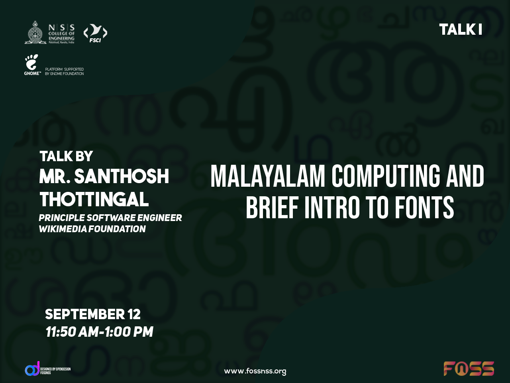

We, the FOSS Cell of NSS College of Engineering, Palakkad presents you a session on **Malayalam Computing and brief intro to fonts** a session by **Mr. Santhosh Thottingal**, Principal software engineer at Language Engineer team, Wikimedia Foundations'. A session to know the what and how of Malayalam computing

> Date:12.09.2020 
> Time:11:50 AM - 1:00 PM

Interested?
> Cost: Free 
> Register - https://ee.kobotoolbox.org/x/fDaTvLeE

To know more about schedule: https://fossnss.org/blog/schedule-for-mini-conference